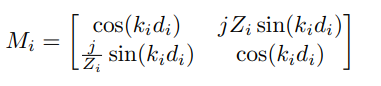

# Modelado Sísmico con Método de Matriz de Transferencia (TMM)

Este proyecto implementa una simulación de la propagación de ondas sísmicas a través de capas terrestres con diferentes propiedades mediante el Método de Matriz de Transferencia (TMM). El modelo calcula los coeficientes de transmisión y reflexión para diferentes frecuencias, proporcionando insights valiosos sobre el comportamiento de las ondas sísmicas en estructuras multicapa.

## Características Principales

- **Modelado realista** de capas terrestres con diferentes propiedades (densidad, velocidad de onda P, espesor)
- **Cálculo preciso** de coeficientes de transmisión y reflexión usando TMM
- **Visualización completa** de resultados mediante gráficos informativos
- **Análisis espectral** de la respuesta en frecuencia del sistema
- **Interfaz intuitiva** con parámetros fácilmente configurables

## Estructura del Modelo

El modelo simula un perfil simplificado de la corteza terrestre con las siguientes capas:

- **Manto Superior**: Alta velocidad y densidad (medio semi-infinito de entrada)
- **Corteza Inferior**: Alta velocidad y densidad
- **Corteza Media**: Velocidad y densidad intermedias
- **Capa Sedimentaria**: Menor velocidad y densidad
- **Suelo Superior**: baja velocidad y densidad
- **Aire**: Muy baja impedancia (medio semi-infinito de salida)

## Resultados y Análisis

El modelo genera visualizaciones que muestran:

- **Estructura de capas**: Representación gráfica de las capas terrestres con sus propiedades
- **Coeficiente de transmisión**: Comportamiento de la transmisión en función de la frecuencia
- **Pérdida de transmisión**: Atenuación de la señal a diferentes frecuencias
- **Impedancia de capas**: Contrastes de impedancia que determinan la reflexión/transmisión
- **Respuesta en frecuencia**: Amplitud y fase de las ondas transmitidas y reflejadas

### Hallazgos clave:
- Las frecuencias bajas (< 2 Hz) se transmiten mejor a través de las capas
- Existen picos de resonancia a frecuencias específicas
- Las frecuencias altas (> 10 Hz) experimentan mayor atenuación
- La mayor discontinuidad de impedancia ocurre entre el suelo superior y el aire

## Instalación y Uso

### Requisitos
- Python 3.7+
- NumPy
- Matplotlib

### Ejecución
```bash
python seismic_tmm_model.py
```

### Personalización del Modelo
Puede modificar las propiedades de las capas en la sección:
```python
layers = [
    [2700, 6000, np.inf, "Manto Superior"],
    [2600, 4000, 5000, "Corteza Inferior"],
    # ... agregar o modificar capas aquí
]
```

## Aplicaciones

Este modelo es útil para:
- Interpretación de datos sismológicos
- Prospección geofísica y estudios de suelos
- Diseño de sistemas de monitoreo sísmico
- Investigación académica en ciencias de la Tierra
- Análisis de efectos de sitio en ingeniería sísmica

## Base Teórica

El Método de Matriz de Transferencia (TMM) resuelve exactamente la ecuación de onda para sistemas multicapa calculando:

- **Impedancia acústica**: $\( Z = \rho c \)$
- **Número de onda**: $\( k = \frac{\omega}{c} \)$
  - **Matriz de transferencia** para cada capa:
    

- **Coeficientes de reflexión/transmisión** a partir del producto de matrices

## Referencias

- Chew, W. C. (1995). Waves and fields in inhomogeneous media.
- Brekhovskikh, L. M. (1960). Waves in layered media.
- Aki, K., & Richards, P. G. (2002). Quantitative seismology.

## Contribuciones

Las contribuciones son bienvenidas. 
1. Hacer fork del proyecto
2. Crear una rama para su característica (`git checkout -b feature/AmazingFeature`)
3. Commit sus cambios (`git commit -m 'Add AmazingFeature'`)
4. Push a la rama (`git push origin feature/AmazingFeature`)
5. Abrir un Pull Request
---

**Nota**: Este modelo es una simplificación con fines educativos. Para aplicaciones sismológicas profesionales, se recomienda utilizar software especializado y validar los resultados con datos empíricos.
